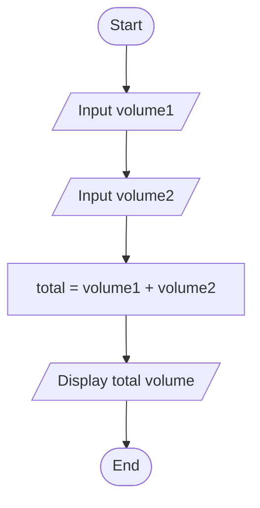

```mermaid
flowchart TD
     A([Start])
     B[/Input volume1/]
     C[/Input volume2/]
     D[total = volume1 + volume2]
     E[/Display total volume/]
     F([End])

     A --> B
     B --> C
     C --> D
     D --> E
     E --> F
```
