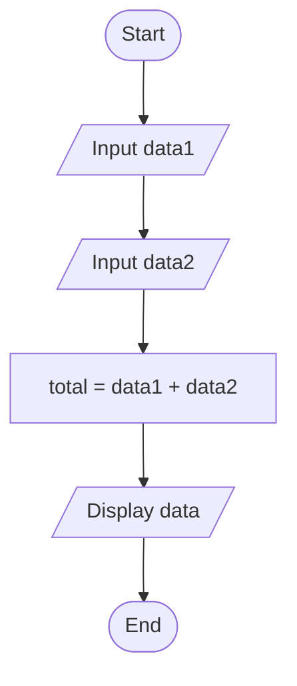

```mermaid
flowchart TD
     A([Start])
     B[/Input data1/]
     C[/Input data2/]
     D[total = data1 + data2]
     E[/Display data/]
     F([End])

     A --> B
     B --> C
     C --> D
     D --> E
     E --> F
```
