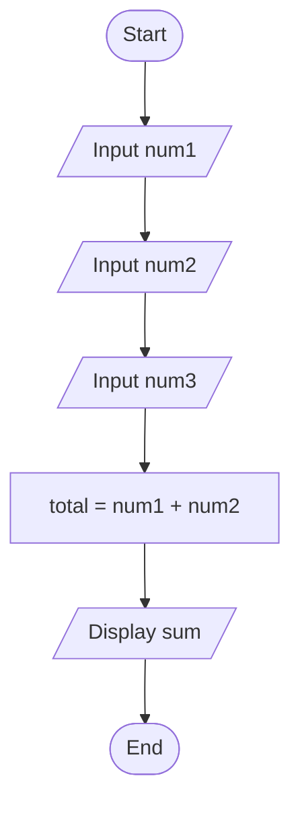

```mermaid
flowchart TD
     A([Start])
     B[/Input num1/]
     C[/Input num2/]
     D[/Input num3/]
     E[total = num1 + num2]
     F[/Display sum/]
     G([End])

     A --> B
     B --> C
     C --> D
     D --> E
     E --> F
     F --> G
```
