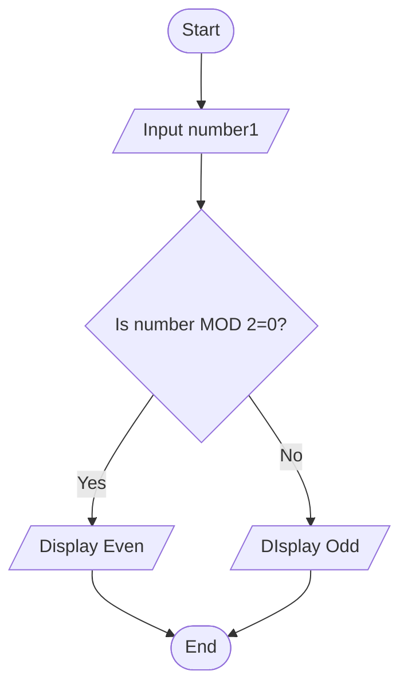

```mermaid
flowchart TD
     A([Start]) --> B[/Input number1/]
     B --> C{Is number MOD 2=0?}
     C -- Yes --> D[/Display Even/]
     C -- No --> E[/DIsplay Odd/]
     D --> F([End])
     E --> F
```
